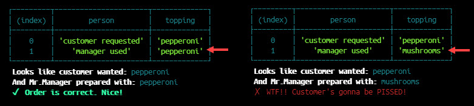
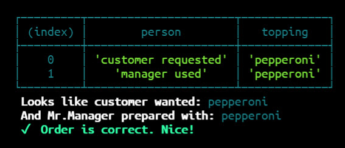

# Digital Pizza


## DESCRIPTION

(made with care in August 2021)

Simple js displays table inside VS Code terminal, showing customer pizza topping and compares to what is actually delivered by the manager.

Uses colored checkmark and 'X' to show PASS/FAIL. You modify the "manager_changed_it" method to give different result (2 possible).

The table is drawn with built-in console class `console.table()`.



## Why this project was built?

Practice! I wanted to toss many javascript parts into one project:

* 5 functions
* Template Literals (backticks)
* mix strings, variables, and _unicode_ in one line.
* use the switch statement
* add (glorious) COLOR to the screen

Works 100% out of the box — no dependencies to install. Run it with npm inside Visual Studio Code.

## How Do I Use It?


**STEP #1 -** Place file into your local project folder.
**STEP #2 -** Open the console inside VS Code: locate your file, right-click on file > "Open in Integrated Terminal".

Run it with `npm digital-pizza.js`.
You should see this...



## How Do I Modify It?

There is only one line to change... the parameter of the method `manager_changed_it()`.

You can either leave it blank, or add a string for the different pizza topping.

```node
// option 1
manager_changed_it();
// option 2
manager_changed_it("mushrooms");
```

The function `order_checker()` compares the 2 toppings. The screen shows GREEN when the toppings match, meaning the pizza was properly made, or RED when the wrong topping was used.

Like this...


## Conclusion

Thanks for visiting and enjoy the script. Oh, yeah... and one more thing... happy coding!

